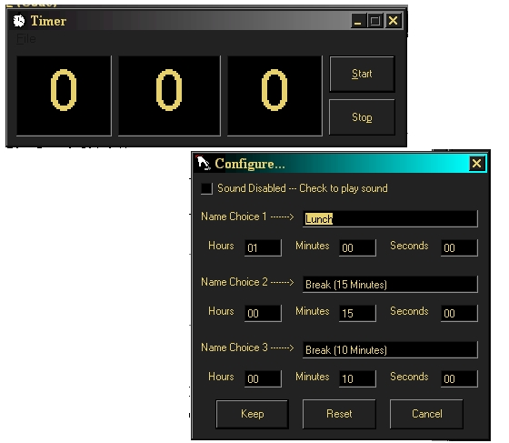



## Count Down Timer

### Description

Just a basic timer. read and write to an ini file for configuration instead of using API calls (see MYINI.bas) the user can configure the settings to play wave files for stoping and starting. I will release further updates in the future (possibly, setting it to configure to use any named wav file for starting and stopping)
 
### More Info
 
just text. type the amount of hours, minutes and seconds to countdown and click start.  the program will increment standard amounts of minutes and seconds (in other words if 1 minute and 90 seconds are input, the computer will not increment the 1 minute until the seconds reaches 0)

the executable, ini file and wav files must all be in the same folder for the program to use them correctly

plays two wave file named TimerStart.wav and TimerStop.wav

will set configuration settings to file Timer.ini

if the ini file is not present, i don't know what will happen. if the wav files are not present or not named correctly, then no sounds will be played.

             |
---                |---
**Submitted On**   |2000-12-24 12:33:04
**By**             |[Ralnautikuus](https://github.com/Planet-Source-Code/PSCIndex/blob/master/ByAuthor/ralnautikuus.md)
**Level**          |Intermediate
**User Rating**    |3.0 (9 globes from 3 users)
**Compatibility**  |VB 6\.0
**Category**       |[Complete Applications](https://github.com/Planet-Source-Code/PSCIndex/blob/master/ByCategory/complete-applications__1-27.md)
**World**          |[Visual Basic](https://github.com/Planet-Source-Code/PSCIndex/blob/master/ByWorld/visual-basic.md)
**Archive File**   |[CODE\_UPLOAD1301212242000\.zip](https://github.com/Planet-Source-Code/ralnautikuus-count-down-timer__1-13838/archive/master.zip)

### API Declarations

see compcontrol.ocx

